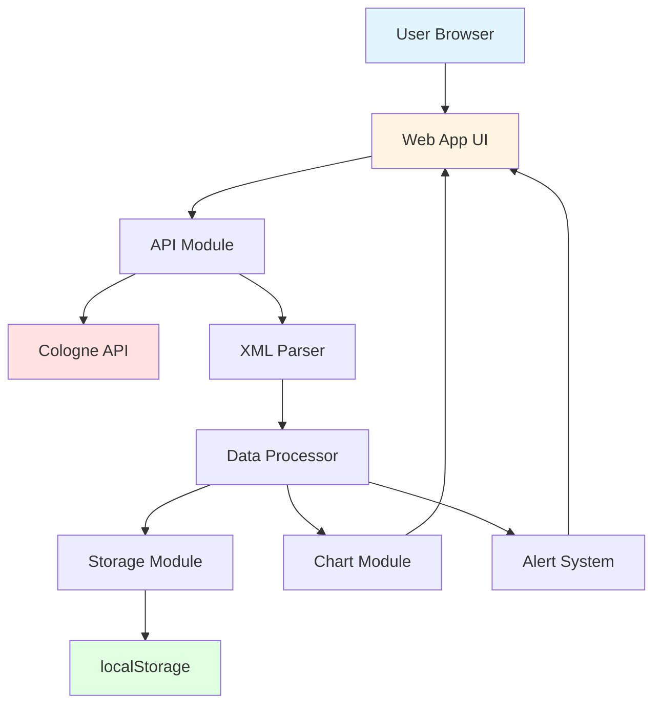

# Rhine River Water Level Monitoring - Architecture Plan

## Project Overview
A real-time web application to display the current water level of the Rhine River in Cologne, Germany, with historical trend visualization and color-coded alert system.

## Data Source
**API Endpoint**: `https://www.stadt-koeln.de/interne-dienste/hochwasser/pegel_ws.php`

**Response Format**: XML
```xml
<Hochwasserpegel>
  <Datum>27. Oktober 2025</Datum>
  <Uhrzeit>15:25</Uhrzeit>
  <Pegel>3,68</Pegel>
  <Grafik>pegel_4.jpg</Grafik>
</Hochwasserpegel>
```

## Alert Thresholds
- **Normal**: < 400 cm (Green)
- **Warning**: 400-800 cm (Orange)
- **Danger**: > 800 cm (Red)

## Technology Stack

### Core Technologies
- **HTML5**: Semantic structure, accessibility
- **CSS3**: Modern styling, animations, responsive design
- **Vanilla JavaScript**: No framework dependencies for simplicity

### External Libraries
- **Chart.js** (v4.x): Historical trend visualization
- **DOMParser API**: Native XML parsing (no dependencies)

### Storage
- **localStorage**: Client-side historical data persistence

## File Structure
```
rhein-pegel-webapp/
├── index.html              # Main HTML structure
├── css/
│   ├── main.css           # Main styles
│   └── responsive.css     # Media queries
├── js/
│   ├── app.js             # Main application logic
│   ├── api.js             # API communication module
│   ├── chart.js           # Chart visualization module
│   └── storage.js         # localStorage management
├── assets/
│   └── favicon.ico        # App icon
├── README.md              # Documentation
└── ARCHITECTURE.md        # This file
```

## System Architecture



## Component Architecture

### 1. API Module (`api.js`)
**Responsibilities**:
- Fetch data from Cologne API
- Handle CORS issues (proxy if needed)
- Error handling and retry logic
- XML to JavaScript object conversion

**Key Functions**:
```javascript
async fetchWaterLevel()
parseXML(xmlString)
convertGermanDecimal(value)
```

**CORS Strategy**:
- Attempt direct fetch first
- If CORS blocked, use `cors-anywhere` or similar proxy
- Fallback to manual data entry option

### 2. Storage Module (`storage.js`)
**Responsibilities**:
- Store historical readings
- Manage data retention (e.g., last 24 hours)
- Data retrieval and aggregation

**Data Structure**:
```javascript
{
  readings: [
    {
      timestamp: 1698415500000,
      waterLevel: 368,
      date: "27. Oktober 2025",
      time: "15:25"
    }
  ]
}
```

**Key Functions**:
```javascript
saveReading(data)
getHistoricalData(hours = 24)
clearOldData()
```

### 3. Chart Module (`chart.js`)
**Responsibilities**:
- Initialize Chart.js instance
- Update chart with new data
- Render threshold lines
- Handle chart animations

**Chart Configuration**:
- Type: Line chart
- X-axis: Time (last 24 hours)
- Y-axis: Water level (cm)
- Threshold lines at 400cm and 800cm
- Gradient background for alert zones

### 4. Alert System
**Responsibilities**:
- Determine current alert level
- Update UI colors and status
- Show appropriate warnings
- Visual and textual indicators

**Alert Levels**:
```javascript
const ALERT_LEVELS = {
  NORMAL: { threshold: 400, color: '#4CAF50', label: 'Normal' },
  WARNING: { threshold: 800, color: '#FF9800', label: 'Warnung' },
  DANGER: { threshold: Infinity, color: '#F44336', label: 'Gefahr' }
}
```

## User Interface Design

### Layout Structure
```
┌─────────────────────────────────────┐
│          Header                     │
│   Rhine Water Level Monitor         │
├─────────────────────────────────────┤
│  ┌───────────────────────────────┐ │
│  │   Current Level Display       │ │
│  │   [Large Number] cm           │ │
│  │   [Status Badge]              │ │
│  └───────────────────────────────┘ │
├─────────────────────────────────────┤
│  ┌───────────────────────────────┐ │
│  │   Historical Chart (24h)      │ │
│  │   [Line Chart]                │ │
│  └───────────────────────────────┘ │
├─────────────────────────────────────┤
│  ┌──────────┐  ┌─────────────────┐│
│  │ [Refresh]│  │Last Update: ... ││
│  └──────────┘  └─────────────────┘│
└─────────────────────────────────────┘
```

### Color Scheme
- **Primary**: #2196F3 (Blue - water theme)
- **Normal**: #4CAF50 (Green)
- **Warning**: #FF9800 (Orange)
- **Danger**: #F44336 (Red)
- **Background**: #F5F5F5 (Light gray)
- **Text**: #212121 (Dark gray)

### Responsive Breakpoints
- Mobile: < 768px (single column)
- Tablet: 768px - 1024px (optimized chart)
- Desktop: > 1024px (full layout)

## Data Flow

### Initial Load
1. Load HTML/CSS/JS
2. Initialize Chart.js
3. Load historical data from localStorage
4. Fetch current data from API
5. Update UI with current level
6. Update chart with historical data
7. Set up auto-refresh timer

### Auto-Refresh Cycle (60 seconds)
1. Fetch new data from API
2. Parse and validate data
3. Compare with previous reading
4. Save to localStorage
5. Update UI elements
6. Add new point to chart
7. Remove old data points (> 24h)

### Manual Refresh
1. Show loading indicator
2. Execute fetch cycle
3. Hide loading indicator
4. Show success/error message

## Error Handling

### Network Errors
- Display user-friendly error message
- Show last successful reading
- Retry with exponential backoff
- Log errors to console

### Data Validation
- Validate XML structure
- Check for required fields
- Validate water level range (0-2000 cm)
- Handle German decimal format

### Fallback Strategies
- Use cached data if API fails
- Show degraded mode notification
- Allow manual data refresh

## Performance Optimization

### Loading
- Minimize HTTP requests
- Use CDN for Chart.js
- Inline critical CSS
- Defer non-critical JavaScript

### Runtime
- Throttle resize events
- Debounce refresh actions
- Limit historical data points
- Use requestAnimationFrame for animations

### Storage
- Compress historical data
- Clean old entries automatically
- Set localStorage size limits

## Accessibility Features

### WCAG 2.1 Compliance
- Semantic HTML5 elements
- ARIA labels for dynamic content
- Keyboard navigation support
- Color contrast ratio > 4.5:1
- Screen reader announcements for updates

### Progressive Enhancement
- Works without JavaScript (basic display)
- Graceful degradation for old browsers
- Print-friendly styles

## Security Considerations

### Data Validation
- Sanitize all API responses
- Validate data types and ranges
- Prevent XSS attacks

### Privacy
- No personal data collection
- No cookies required
- No external tracking

## Deployment Options

### Static Hosting
- GitHub Pages
- Netlify
- Vercel
- Any web server

### Requirements
- Static file hosting
- HTTPS support (recommended)
- No backend required

## Future Enhancements

### Phase 2 Features
- PWA support (offline mode)
- Push notifications for alerts
- Multiple measurement points
- Export data (CSV/JSON)
- Multi-language support (EN/DE)

### Phase 3 Features
- Historical data comparison
- Weather integration
- Flood prediction algorithm
- Mobile app wrapper

## Development Timeline

1. **Setup & Structure** (1-2 hours)
   - File structure
   - HTML skeleton
   - Basic CSS framework

2. **Core Functionality** (3-4 hours)
   - API integration
   - XML parsing
   - Data storage
   - Basic UI

3. **Visualization** (2-3 hours)
   - Chart.js integration
   - Historical data display
   - Animations

4. **Polish & Testing** (2-3 hours)
   - Responsive design
   - Error handling
   - Browser testing
   - Documentation

**Total Estimated Time**: 8-12 hours

## Success Metrics

### Functional Requirements
- ✓ Display real-time water level
- ✓ Show historical trend (24h)
- ✓ Color-coded alerts
- ✓ Auto-refresh (60s)
- ✓ Manual refresh option
- ✓ Responsive design

### Performance Metrics
- Initial load: < 2 seconds
- Data fetch: < 500ms
- Chart render: < 100ms
- Lighthouse score: > 90

### Browser Support
- Chrome/Edge (last 2 versions)
- Firefox (last 2 versions)
- Safari (last 2 versions)
- Mobile browsers (iOS/Android)

## Technical Decisions & Rationale

### Why Vanilla JavaScript?
- No build process needed
- Smaller bundle size
- Faster initial load
- Easy deployment
- Better for learning

### Why Chart.js?
- Lightweight and performant
- Excellent documentation
- Active community
- Responsive by default
- Beautiful defaults

### Why localStorage?
- No backend required
- Fast access
- Persistent across sessions
- Simple API
- Sufficient for 24h data

### Why No Framework?
- Project complexity doesn't justify it
- Better performance for simple use case
- Easier maintenance
- Lower barrier to contribution
- Educational value